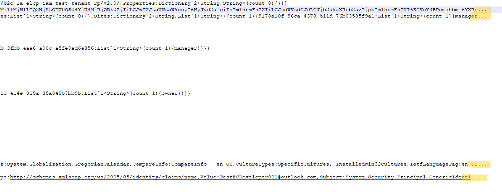
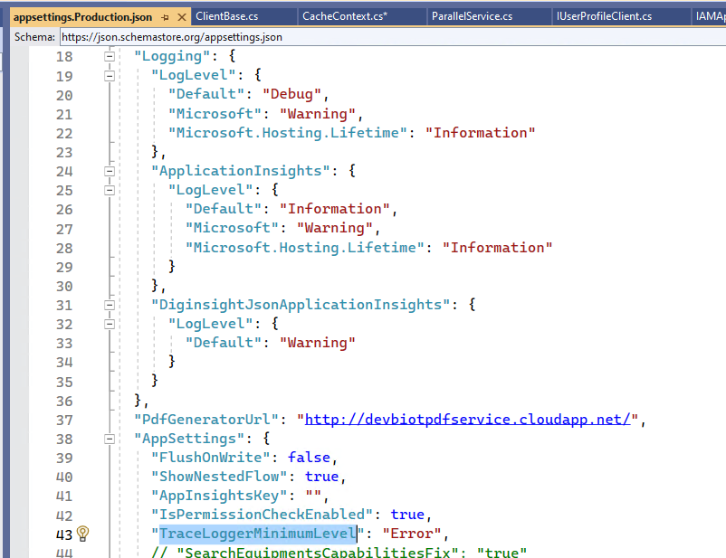
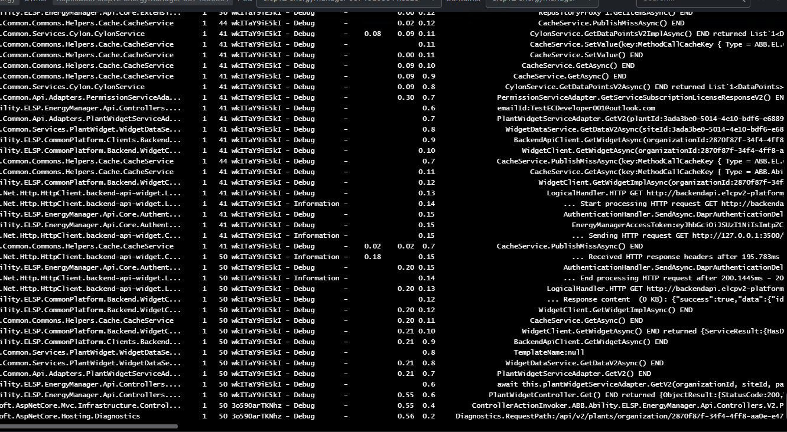

# INTRODUCTION 
Diginsight brings __application behavior observability__ to the next step.<br>
In particular it extends dotnet `Ilogger` system and tracks methods execution with their nesting, parameters and variables in a very effective and readable way.<br>

The following example shows the execution flow of a sample application with the execution of a MainWindow constructor and initialization.<br>


In the following paragraphs we'll understand how this can be obtained without impact on the application performance.<br>
Also, you will soon learn that diginsight can be of great help with identifying and reducing `high latency flows` and `redundant flows` within the application execution paths.<br>
So diginsight can greatly contribute to application performance optimization more than provide a limitation to it. 

With article:<br>
[HOWTO - Make your application flow observable.md](HOWTO%20-%20Make%20your%20application%20flow%20observable.md)<br>
We'll explore __how we can make our application flow fully observable__.<br><br>

# Performance considerations
Rendering the application flow involves a few risks of impact on application performance:<br>
- __risk n°1__. gathering methods and variables descriptions may require processing time<br>
- __risk n°2__. creating the log rows may involve a lot of string management<br>(with associated CPU and memory consumption).<br>
- __risk n°3__. writing the application flow to external resources may involve a lot of IO operations<br> (with creation of big log files, log databases a high network bandwith consumption)

To avoid impacts from these risks diginsight has been designed to ensure:
- __no processing__ must be involved by diginsight where application flow rendering is __disabled__
- __minimal possible processing__ must be involved by diginsight where application flow rendering is __enabled__
- __application flow rendering can be enabled selectively, only when useful__ <br>(eg. only while troubleshooting or when exceptions happen).

In the following paragraphs we'll go deep into the main __strategies__ Diginsight implements to ensure these conditions.

## Strategy n°1: diginsight gathers execution flow from static variables and compiler generated information
Diginsight application flow is essentially gathered from static variables and compiler generated information.<br>
- method names are obtained by compiler generated attributes 
- other information such as process, assembly and thread information is taken once and cached during the overall flow execution 
- variable descriptions are generated by means of `ISupportLogString` and `IProvideLogString` interfaces that may produce strings in optimized way, without use of reflection.

This ensures that, when application flow rendering is enabled, performance impact is limited to the possible minimum.<br>

## Strategy n°2: diginsight doesn't process data that is not really written
Diginsight gathers information about the application execution without processing it.<br>
Pointers to information such as the method name, the class name the parameters list are gatered into a Stack allocated `TraceEntry`.<br>
__Only if rendering is enabled for that line__ information within the trace entry is used to compose the log string.<br>

The following snippet provides a simplified version of the TraceEntry structure:
```c#
public ref struct TraceEntry
{
	public string Message { get; set; }
	[JsonIgnore]
	public string MessageFormat { get; set; }
	[JsonIgnore]
	public object[] MessageArgs { get; set; }
	[JsonIgnore]
	public object MessageObject { get; set; }
	[JsonIgnore]
	public Func<string> GetMessage { get; set; }
	public IDictionary<string, object> Properties { get; set; }
	public string Source { get; set; }
	public string Category { get; set; }
	public LogLevel LogLevel { get; set; }
	public long TraceStartTicks { get; set; }
	public Exception Exception { get; set; }
	public int ThreadID { get; set; }
	public ApartmentState ApartmentState { get; set; }
    public ICodeSection CodeSectionBase { get; set; }
	...

}
```
__If rendering for the line is enabled__ the logstring is created with a single `string.format` statement, with minimal possible string management, according to the configuration for the log listener.<br>
Also, only the TraceEntry properties that are needed to compose the log string are used Properties that are not configured to be included into the output log are not used at all.<br>

__If rendering for the line is not enabled__ only the TraceEntry allocation is executed and no string composition or any write operation is processed.<br>

## Strategy n°3: diginsight supports `string interpolation handlers` and `delegate overloads`
Diginsight supports string interpolation by means of `string interpolation handlers`.<br>
In the example below, the interpolated string is composed within the overloads after evaluating if the Debug LogLevel is enabled. 
```c#
scope.LogDebug($"await app.GetAccountsAsync(); returned {accounts.GetLogString()}");
```
__if the Debug LogLevel is not enabled__ the interpolated string is not constructed and the placeholder (accounts.GetLogString()) is not evaluated at all.<br> 

A similar logic is applied with delegate overloads.<br>
In the image below, the `BeginMethodScope()` parameter list and `LogDebug()` parameters are received in the form of delegate. <br><br>

Also in this case, __if the Debug LogLevel is not enabled__ the delegate is not evaluated and the payload allocation and initialization doesn't happen at all. 


## Strategy n°4: diginsight reduces the log size with default truncation for long messages and payloads
When producing logs with the application flow, data from variables and parameters can be big.<br>
If this happens the log file may become big and difficult to read. <br>
<br>
Diginsight prevents this problem applying a __default truncation__ to log strings. 

in particular, truncation happens by means of the following configurations:
```c#
"MaxMessageLen" (def. 256): messages are truncated to 256 chars by default
"MaxMessageLenInfo" (def. 512): Information messages are truncated to 512 chars by default
"MaxMessageLenWarning" (def. 1024): Warning messages are truncated to 1024 chars by default
"MaxMessageLenError" (def. -1): Error messages are not truncated by default
```
When message truncation happens an ellipsis is appended to the end of the string as shown below:<br>

<br>
When message truncation happens in trace START lines, truncation is applied to the parameter list and the START symbol is preserved<br>
<br>

It may happen that log information such as a Request Body or a Response Content are required not to be truncated.<br>
The developer may decide to override truncation thresholds by means of the `Log***()` `properties` parameter.<br>
In the following example log truncation is set for the response content to a __5MB limit__. 

```c#
TraceLogger.LogDebug($"Response content  ({(double)rawContent.Length / 1024:#,##0} KB): {rawContent}", null, new Dictionary<string, object>() { { "MaxMessageLen", 5242880 } });
```

## Strategy n°5: diginsight allows enabling logs dinamically, only when needed
Application flow is rendered by default at the Debug level.<br>
ILogger standard configuration can be used to specify which modules are expected to produce their logs.<br>
<br>

Diginsight allows cutting the enabled log level by means of a __special configuration appSetting__ (`TraceLoggerMinimumLevel`) that __can be overridden dinamically by the developer or by the tester__ at the process level or at a single HTTP call level.<br>

The configuration file above shows that for our production environment `TraceLoggerMinimumLevel` is set `Error`.<br>
(so, the application flow will not be rendered by default)

The image below shows that calling the server with the HTTP header `TraceLoggerMinimumLevel` `Trace`.<br>  

 
 the appsetting is overridden and the log is produced for our specific call<br>

<br>

in this case readability of the application flow is preserved and troubleshooting of the specific case is made possible.

Future library improvements may include automatic activation of application flows that produce errors.

# Additional best practices
When using diginsight it is important to follow normal guidelines of general good sense:

- limit using Method Scopes (and logging statements in general) on strict loops 
- limit using Method Scopes (and logging statements in general) on deeply recursive methods 
- avoid sending Trace and Debug level telemetry to providers that write to the network or other io-bound resources (eg. Application Insight) 

<br><br>

# Build and Test 
Clone the repository, open and build solution Common.Diagnostics.sln. 
run EasySample and open the log file in your **\Log** folder.

# Contribute
Contribute to the repository with your pull requests. 

- [ASP.NET Core](https://github.com/aspnet/Home)
- [Visual Studio Code](https://github.com/Microsoft/vscode)

# License
See the [LICENSE](LICENSE.md) file for license rights and limitations (MIT).
